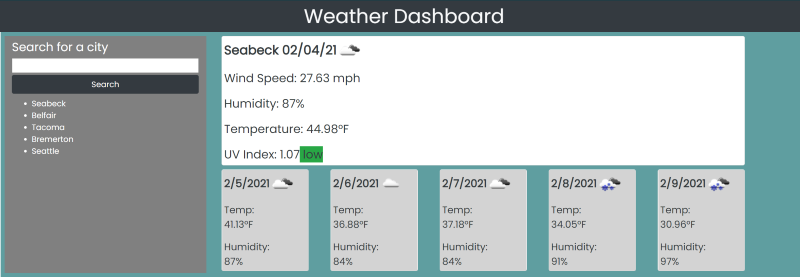
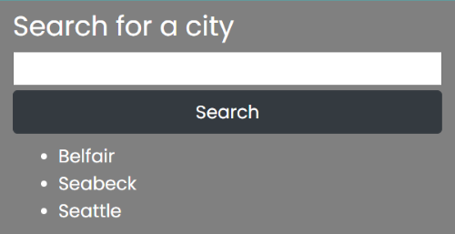

# Weather Dashboard
A weather application that allows users to search for their city of choice to display current and forecasted weather conditions.

### You will find:
* Dynamic content generates to the browser
* Mobile responsiveness
* History list of past searches, which can be recalled on click
* History list saves on refresh
* Adjusting indicator to alert UVI status
* polished and intuitive UI 

### Resources:
* Google
* W3 School
* MDN
* Free Code Camp
* Geeks for Geeks
* Bootstrap Docs
* JQuery Docs
* Open Weather Maps API content and docs
* Momentjs
* Activity #26, "LocalStorage Todos", from section 4, Web APIs

### Technologies:
* HTML
* CSS
* Bootstrap 4
* JavaScript
* JQuery
* MomentJs
* Open Weather Maps API

### Links:
* URL: https://shaylastevenson.github.io/weather-dashboard/

* Github Repo: https://github.com/ShaylaStevenson/weather-dashboard

### Contact Me:
* View my personal portfolio: https://shaylastevenson.github.io/portfolio/
* Email: shayla.rose.stevenson@gmail.com
